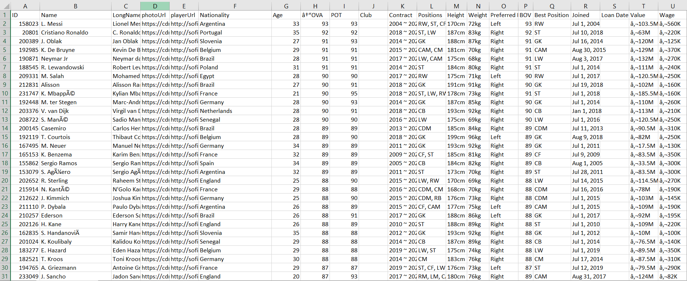
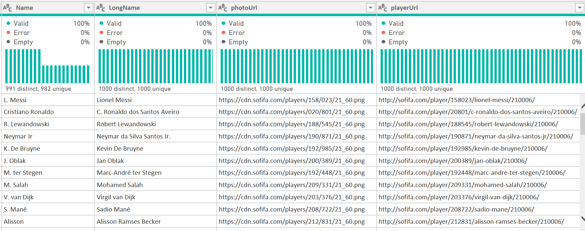
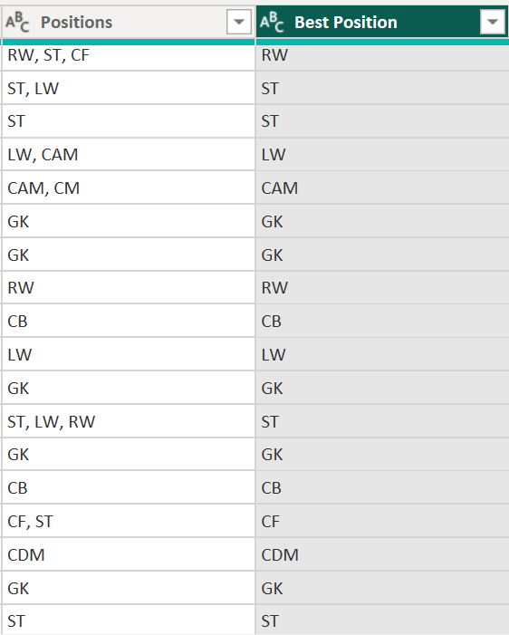
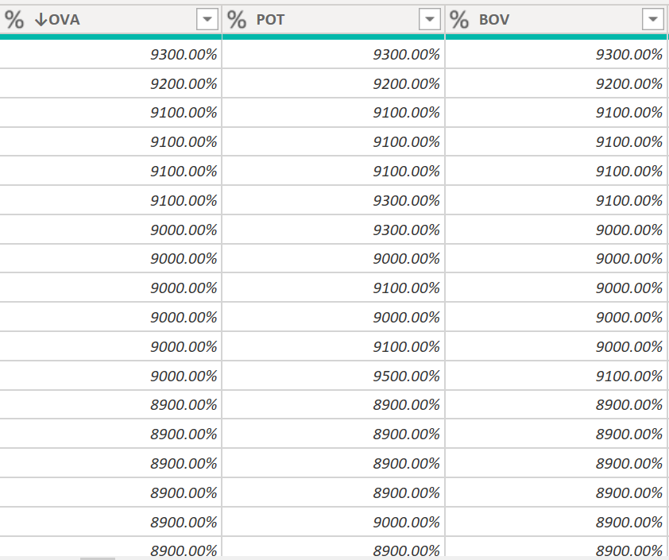
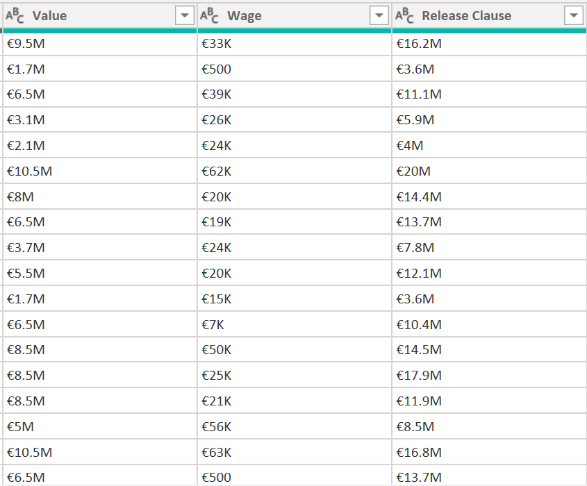
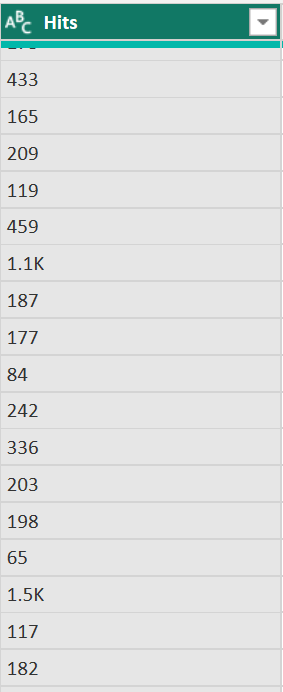

# Fifa 21 data cleaning project with Power BI


## Introduction
Data cleaning is an essential process in any data analysis project, as it involves identifying and correcting errors, inconsistencies, and inaccuracies in the data. In this project, we focused on cleaning the FIFA 21 data, which is a popular video game that simulates real-world soccer matches. The data set contains information on players, teams, and various attributes such as player ratings, physical characteristics, and performance statistics.

This project was inspired by a twitter #Datacleaning challenge organised by @PromiseNonso_. The primary objective of the project was to ensure that the data was accurate, consistent, and complete by identifying and removing duplicate records, missing values, and outliers. Next, standardizing the data by ensuring that all the variables were in a consistent format and units of measurement. Overall, the FIFA 21 data cleaning project was a crucial step in ensuring that the data used in the analysis was reliable and consistent, leading to more accurate results and better-informed decisions.

## Objectives of the Data Cleaning Process
There were some major process carried out to prepare the data for analysis and I will work you through it:

* Removal of duplicte or irrelevant observations.
* Standardizing of data types across all columns.
* Handling missing data

## Data Description
The FIFA 2021 dataset, which is available on [Kaggle](https://www.kaggle.com/datasets/yagunnersya/fifa-21-messy-raw-dataset-for-cleaning-exploring), has 18,979 rows and 77 columns. Each row and column in the dataset represents a different player attribute, such as the player's age, height, weight, nationality, club, position, and various other statistics pertaining to their performance on the field. The player's overall rating, which is an average score based on numerous criteria, and their prospective rating, which indicates their greatest possible rating if they were to attain their full potential, are two of the dataset's most important aspects. Their favourite foot, weak foot skill, skill movements, and several features relating to their playing position are additional crucial characteristics.



## Data Cleaning Procedure

Before starting the cleaning process, I copied the original dataset to another location because making copies of the original dataset serves as a backup in case the my original data is lost or corrupted during the analysis process.

### Removing unwanted columns

First of all, the data was imported into Power BI where all the data cleaning proceedures was done in Power Query in M language. At first glance, some unwanted or irrelevant columns were dropped from the dataset, columns such as **photoUrl**, **playerUrl** which held a url to an image and a website where all the information about the players in the dataset was gathered. The **Name** field was also eliminated because its content is nearly identical to that of the **LongName** column. After more analysis was done, a few additional columns were eliminated along the way.



### Removing whitespaces
White spaces at the beginning or at the end of text can cause issues when trying to identify duplicate records so to solve I used the **TRIM** function on the **Name**, **LongName**, **Nationality** & **Club** column. _[see the M code below;]_ 

```
= Table.TransformColumns(#"Trimmed Text3",{{"LongName", Text.Trim, type text}, {"Nationality", Text.Trim, type text}, {"Club", Text.Trim, type text}})
```
### Data type Standardization

### The Contract column
The contract column is a column that displays how long a player has been under contract with the club in the format of the year the contract began and the year it is set to finish, e.g. 2019-2023. But, following further inspection, I discovered that the contract column had certain rows that were of text data type, indicating whether the player was on free transfer or was on loan, as well as the date the loan took effect. 


Then arose the issue of how to fix it so, I initially thought to split the column into two columns, Contract begin and Contract end indicating the starting year and ending year of the contract respectively but, I needed more information about the players on loan and on free transfer which I couldn't get from the **Contract** column.


So I created a conditional column which I named **Contract Status** which showed if a player was *Under Contract*, *On Loan*, and *Free Agent*. _[see the M code below;]_

```
= Table.AddColumn(#"Replaced Value", "Contract Status", each if Text.Contains([Contract], "Free") then "Free Agent" else if Text.Contains([Contract], "Loan") then "On Loan" else "Under Contract")
```

### The Position columns
The dataset had two columns that contained the positions of each players, one was the **Positions** column where some players had more than one positions which they could played, while the the other, **Best Position** contained the best positions of the player. The latter column was dropped because it was redundant have both columns and could very well cause some confusing down the line




### The Height and Weight column
The **height** and **weight** column lists the players' physical characteristics, but it has to be cleaned up since, as the image below demonstrates, the content is not normalised because **Height** is measured in centimetres (cm) and inches (") and **Weight** is listed in kilogrammes (kg) and pounds (lbs) (lbs).


To fix the **Height** column:

*  With the aim of converting the inches to cm and and due to the small number of instances of inches, I replaced the inches such as 5'4" to its equivalent centimetre, 163cm using the replace values funcion. _[see the M code below;]_
```
= Table.ReplaceValue(#"Sorted Rows","5'4""","163",Replacer.ReplaceText,{"Height"})
```
*   Then I removed the cm in the column using replace values. _[see the M code below;]_
```
Replace value:
= Table.ReplaceValue(#"Changed Type2","cm","",Replacer.ReplaceText,{"Height"})
Change Type:
= Table.TransformColumnTypes(#"Reordered Columns5",{{"Height", Int64.Type}})
```
The same was done for the rest. I do not recommend this method because of its inefficiency, especially because if the dataset was much larger with will be time wasting and very cumbersome.

To fix the **Weight** column:
*   I created another column using the conditional column function that assigned a value of 1 to the equivalent row of any weight ending in "lbs" and a value of 2.205 to any weight ending in "kg." _[see the M code below;]_
```
= Table.AddColumn(#"Reordered Columns2", "Custom", each if Text.EndsWith([Weight], "kg") then 2.20462 else 1)
```
*   I then removed the units kg, lbs of the **weight** column using the replace value function. _[see the M code below;]_ 
```
Removing kg:
= Table.ReplaceValue(#"Added Conditional Column1","kg","",Replacer.ReplaceText,{"Weight"})

Removing lbs:
= Table.ReplaceValue(#"Replaced Value25","lbs","",Replacer.ReplaceText,{"Weight"})
```
*   I then multiplied the **weight** column to the **custom** column i created. _[see the M code below;]_ 
```
= Table.AddColumn(#"Changed Type8", "Multiplication", each [Custom] * [Weight], type number)
```

### OVA, POT and BOV
The **OVA**, **POT** and **BOV** columns contain the exact overall rating , the potential overall rating, and the best overall rating of a player respectively. The columns were in whole number datatype which I then changed to percentage. _[see the M code below;]_
```
= Table.TransformColumnTypes(#"Reordered Columns5",{{"BOV", Percentage.Type}, {"POT", Percentage.Type}, {"↓OVA", Percentage.Type}})
```


### Value, Wage and Release clause
The **value**, **wage** and **release clause** columns all contained the amount of money a player is paid or money that surrounds a players contract. The money value was in euros across the columns but the figures in the columns contained letters such a K for thousand and M for million.  



To fix this:
*   I removed the euro sign using the replace value function. _[see the M code below;]_
    ```
    = Table.ReplaceValue(#"Replaced Value14","€","",Replacer.ReplaceText,{"Value", "Wage", "Release Clause"})
    ```
*   I replaced "." with "," _[see the M code below;]_
    ```
    = Table.ReplaceValue(#"Replaced Value14",".",",",Replacer.ReplaceText,{"Value"})
    ```
*   I replaced "K" with "000" _[see the M code below;]_
    ```
    = Table.ReplaceValue(#"Replaced Value14","K","000",Replacer.ReplaceText,{"Value", "Wage", "Release Clause"})
    ```
*   I replaced "M" with "000000" _[see the M code below;]_
    ```
    = Table.ReplaceValue(#"Replaced Value14","M","000000",Replacer.ReplaceText,{"Value", "Wage", "Release Clause"})
    ```
*   In most cases, when you alter or modify the content of a column it automatically changes the type of the content to a text and so I changed the columns to the number type which automatically removes the comma which I initially put and just like that it was done. _[see the M code below;]_
    ```
    = Table.TransformColumnTypes(#"Duplicated Column2",{{"Release Clause", Int64.Type}, {"Wage", Int64.Type}, {"Value", Int64.Type}})
    ```
### W/F, SM and IR columns
W/F - **Weak foot**, SM - **Skill moves**, and IR - **International reputation** columns all contain ratings on a scale of 1-5. The values in these columns had the special character '☆' in them and their data type was text which changed to number after removing the special character. _[see the M code below;]_


```
Removing the special character
= Table.ReplaceValue(#"Changed Type10","★","",Replacer.ReplaceText,{"W/F", "SM", "IR"})

changing datatype
= Table.TransformColumnTypes(#"Reordered Columns5",{{"BOV", Percentage.Type}, {"W/F", Int64.Type}, {"SM", Int64.Type}, {"IR", Int64.Type}})
```
### Hits column
The **hits** column contained values of how many hits a players has totaled. The values in the column were in text type and some of the values contained a text character K which stood for thousand.



So I created another column using the conditional column function which has 2 distinct values "1" and "1000". 1000 if the equivalent value in the hits column contains the character k and 1 if it doesn't. _[see the M code below;]_
```
= Table.AddColumn(#"Replaced Value27", "Custom", each if Text.EndsWith([Hits], "K") then 1000 else 1)
```
Then I multiplied the hits column with the newly created column after which I changed the datatype to whole number. _[see the M code below;]_
```
Multiply 
= Table.AddColumn(#"Changed Type11", "Multiplication", each [Custom] * [Hits], type number)
Change type
= Table.TransformColumnTypes(#"Inserted Multiplication",{{"Multiplication", Int64.Type}})
```
### Conclusion
This is my first project in data analysis in general and it was a wonderful experience and it won't stop here the clean data will later be used in a data analysis project.  
